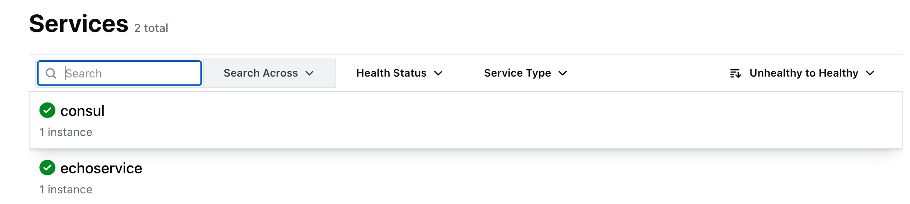

# Day1：微服务通信

我们打算将商城项目拆分成多个项目，也就是微服务

## 背景

微服务的通讯方式主要有以下几种：

- **RESTful API**：基于 HTTP 协议的 RESTful API 是最常用的微服务通讯方式之一。服务之间通过 HTTP 请求和响应进行通讯，实现数据交换。这种方式简单、通用，适用于各种场景，但可能不适合对实时性要求非常高的场景。
- **RPC（远程过程调用）**：RPC 允许一个服务像调用本地方法一样调用另一个服务的方法。它通过将方法调用封装成网络数据包并在不同的进程之间传输，实现不同服务之间的互相调用。RPC 方式可以提高调用的效率和性能，但可能需要更多的配置和管理工作。
- **消息队列通讯**：如 RabbitMQ、Kafka、RocketMQ 等，服务之间不直接调用，而是通过消息队列进行异步消息传递，实现服务之间的解耦和异步处理。
- **事件驱动通讯**：服务之间通过事件触发通讯，一旦某个服务发生了某个事件，就会触发其他服务的响应。这种方式可以实现服务的松耦合和事件的实时处理，典型的实现如 Event Bus。
- **WebSocket（长连接通信）**：使用 WebSocket 实现双向通信，常用于实时推送场景，服务间可以维持长期的 TCP 连接进行数据交换。

RESTful API 常用于浏览器和服务器之间的通信，第三方接口通讯等。RPC 多用于微服务内部间的调用。

本节实现RPC通信，为后面实现微服务打基础。

## 实战

### 生成RPC框架代码

编写简单的idl，我们将使用Protobuf作为演示

```proto
syntax = "proto3";

package echo;

option go_package = "/echo";

message Req{
    string mes = 1;
}

message Resp{
    string resp = 1;
}

service EchoService{
    rpc Echo(Req) returns(Resp){}
}
```

根据idl生成代码，我们使用字节的代码生成工具[cwgo](https://www.cloudwego.io/zh/docs/cwgo/)

!!! tip 

    字节的[kitex](https://www.cloudwego.io/zh/docs/kitex/)也能生成rpc框架代码，由于我们项目涉及http和rpc，所以使用集成http和rpc的cwgo演示

???+ tip "使用cwgo需要注意几个细节"

    [go_package怎么写](https://www.cloudwego.io/zh/docs/kitex/tutorials/code-gen/code_generation/#%E4%BD%BF%E7%94%A8-protobuf-idl-%E7%9A%84%E6%B3%A8%E6%84%8F%E4%BA%8B%E9%A1%B9:~:text=Copy-,%E4%BD%BF%E7%94%A8%20protobuf%20IDL%20%E7%9A%84%E6%B3%A8%E6%84%8F%E4%BA%8B%E9%A1%B9,-kitex%20%E4%BB%85%E6%94%AF%E6%8C%81)


**输入cwgo代码生成命令**

```bash
cwgo server  --type RPC  --idl echo.proto  --server_name echoservice --module hello -I ./idl
```

解释一下：

- `service`:指定服务名称，用于服务注册、服务发现等功能(不建议使用)
- `server_name`:服务名称，用于服务注册、服务发现等功能
- `type`：指定生成类型，支持参数 RPC、HTTP，默认为 RPC
- `module/mod`：指定 go mod 名称，非 GOPATH 下必须指定，GOPATH 下默认以相对于 GOPATH 的路径作为名字
- `idl`：指定主 IDL 文件路径
- `I`：添加 IDL 搜索路径，只对 pb 生效

[生成代码结构说明](https://www.cloudwego.io/zh/docs/cwgo/tutorials/layout/#%E4%BB%A3%E7%A0%81%E7%BB%93%E6%9E%84)

整理go依赖

```bash
go mod tidy
```

### 实现基本Echo服务

与RPC相关的代码：

- `kitex_gen`目录：存放rpc框架代码，这部分不用动
  - `echo/echoservice`目录存放服务`echoservice`代码，对应idl的`service`
  - `echo`目录中的`echo.pb.go`存放idl定义的数据结构，对应`message`
- `biz/service`目录：存放rpc业务逻辑层代码
- `handler.go`：rpc业务逻辑层入口
- `main.go`

```bash
cd biz/service/echo.go
```

找到Run函数

```go
// Run create note info
func (s *EchoService) Run(req *echo.Req) (resp *echo.Resp, err error) {
	// Finish your business logic.

	return
}
```

我们想实现一个Echo功能的rpc服务，即输入什么就返回什么

```go
// Run create note info
func (s *EchoService) Run(req *echo.Req) (resp *echo.Resp, err error) {
	// Finish your business logic.

	return &echo.Resp{
		Resp: req.Mes,
	}, nil
}
```

微服务会涉及到服务发现，我们先不实现这一部份，留到最后实现，此处先人工绑定rpc服务地址和端口

在`main.go`中找到：

```go
func kitexInit() (opts []server.Option) {
	// address
	addr, err := net.ResolveTCPAddr("tcp", conf.GetConf().Kitex.Address)
	if err != nil {
		panic(err)
	}
	opts = append(opts, server.WithServiceAddr(addr))

	// service info
	opts = append(opts, server.WithServerBasicInfo(&rpcinfo.EndpointBasicInfo{
		ServiceName: conf.GetConf().Kitex.Service,
	}))
    ...
```

只有这部分与rpc有关，这部分代码的意思是通过读取conf文件设置了`serviceAddr`和`serviceName`

我们先不通过conf文件读取，人工写死这两个变量

```go
	addr, err := net.ResolveTCPAddr("tcp", "127.0.0.1:8888")
	if err != nil {
		panic(err)
	}
	opts = append(opts, server.WithServiceAddr(addr))

	// service info
	opts = append(opts, server.WithServerBasicInfo(&rpcinfo.EndpointBasicInfo{
		ServiceName: "Echo",
	}))
```

服务端代码填写完成，接下来我们完成rpc客户端代码

创一个client目录
```bash
mkdir -p cmd/client
```

[cmd目录含义](https://studygolang.com/articles/30164?fr=sidebar#google_vignette)

创客户端代码client.go

```go
package main

import (
	"context"
	"fmt"
	"hello/kitex_gen/echo"
	"hello/kitex_gen/echo/echoservice"

	"github.com/cloudwego/kitex/client"
)

func main() {
	cli, err := echoservice.NewClient("echoservice",
		client.WithHostPorts("127.0.0.1:8888"),
	)
	if err != nil {
		panic(err)
	}

	req := &echo.Req{
		Mes: "hello, world",
	}
	resp, err := cli.Echo(context.Background(), req)
	if err != nil {
		panic(err)
	}
	fmt.Println(resp)
}
```

开两个窗口，一个在`tutorial/day1/code`下运行服务端`go run .`，一个在`tutorial/day1/code/cmd/client`运行客户端`go run client.go`

客户端响应为`resp:"hello, world"`则运行成功

聪明的你已经知道，从conf中读取和这里介绍的写死是一个效果，不再赘述（只需注意cwgo默认读取test环境中的conf）

**服务端`main.go`：**

```go
func kitexInit() (opts []server.Option) {
	addr, err := net.ResolveTCPAddr("tcp", conf.GetConf().Kitex.Address)
	if err != nil {
		panic(err)
	}
	opts = append(opts, server.WithServiceAddr(addr))

	// service info
	opts = append(opts, server.WithServerBasicInfo(&rpcinfo.EndpointBasicInfo{
		ServiceName: conf.GetConf().Kitex.Service,
	}))
    ...
```

**客户端`cmd/client/client.go`**
```go
package main

import (
	"context"
	"fmt"
	"hello/conf"
	"hello/kitex_gen/echo"
	"hello/kitex_gen/echo/echoservice"

	"github.com/cloudwego/kitex/client"
)

func main() {
	cli, err := echoservice.NewClient(conf.GetConf().Kitex.Service,
		client.WithHostPorts(conf.GetConf().Kitex.Address),
	)
	if err != nil {
		panic(err)
	}

	req := &echo.Req{
		Mes: "hello, world",
	}
	resp, err := cli.Echo(context.Background(), req)
	if err != nil {
		panic(err)
	}
	fmt.Println(resp)
}
```

### 服务注册与发现

我们选择使用[consul](https://developer.hashicorp.com/consul)作为服务注册与发现组件

同时，本项目使用docker使用组件

??? info "consul容器的选择"

    官方给出了以下解释，因此我们实际选用容器`hashicorp/consul`，而不是`consul`

    Upcoming in Consul 1.16, we will stop publishing official Dockerhub images and publish only our Verified Publisher images. Users of Docker images should pull from hashicorp/consul instead of consul . 

我们不直接使用docker，而是使用更加方便的docker-compose

根据官方文档[docker启动方式](https://developer.hashicorp.com/consul/tutorials/archive/docker-container-agents#configure-and-run-a-consul-server)编写docker-compose

```
version: '3'
services:
  consul:
    image: 'consul:1.20'
    ports:
      - 8500:8500
```
下载并启动docker

```bash
docker-compose up -d
```

确认consul是否启动

```bash
docker ps -a
```

---

接下来编写对接consul的服务端代码，参考[kitex with consul](https://www.cloudwego.io/zh/docs/kitex/tutorials/third-party/service_discovery/consul/)

`main.go`

```go
func kitexInit() (opts []server.Option) {
    ...
	//registry
	r, err := consul.NewConsulRegister("127.0.0.1:8500")
	if err != nil {
		log.Fatal(err)
	}
	opts = append(opts, server.WithRegistry(r))
    ...
```
同样可以改为从conf中读取
```go
func kitexInit() (opts []server.Option) {
    ...
	//registry
	r, err := consul.NewConsulRegister(conf.GetConf().Registry.RegistryAddress[0])
	if err != nil {
		log.Fatal(err)
	}
	opts = append(opts, server.WithRegistry(r))
    ...
```

浏览器打开`127.0.0.1:8500`可以看到如下效果：

  

说明成功实现注册中心

---

接下来完成服务发现

`client.go`
```go
func main() {
    // 声明服务发现中心
	r, err := consul.NewConsulResolver(conf.GetConf().Registry.RegistryAddress[0])
	if err != nil {
		log.Fatal(err)
	}

	cli, err := echoservice.NewClient(conf.GetConf().Kitex.Service,
		client.WithResolver(r),
	)
    ...
```

如之前得到`resp:"hello, world"`说明服务发现成功。

### RPC进阶

#### RPC元信息读取

[Kitex metainfo官方文档](https://www.cloudwego.io/zh/docs/kitex/tutorials/advanced-feature/metainfo/#%E5%85%83%E4%BF%A1%E6%81%AF)

Kitex支持两种协议：`thrift`和`protobuf`

前面我们使用proto作为idl，因此我们首先展示基于gRPC的Kitex元信息读取

**需要注意的是：thrift能够使用rpcinfo，而protobuf不行**

---

**什么是正向/反向元信息传播**

从客户端到服务端发送元信息称为「正向元信息传播」:

- 当客户端发起一个gRPC调用时，它可以附加一些元数据到请求中。这些元数据是通过调用特定的方法（例如在某些语言中使用ClientInterceptor或直接在stub上设置metadata）添加的。

- 这些信息会随着请求一起发送到服务端。服务端可以通过访问传入的context对象来读取这些元数据，从而进行必要的处理，如验证用户身份或解析自定义协议头。

从服务端返回客户端称为「反向元信息传播」:

- 类似地，服务端也可以在响应中附加元数据。这可以通过在服务实现中操作context对象来完成。
当服务端发送响应时，这些附加的元数据会被传递回客户端。客户端可以通过拦截器（Interceptor）或者其他方式获取并处理这些元数据，比如用于调试目的或根据服务端的指示执行某些逻辑。

##### 正向元信息传播

=== "gRPC"

    `client.go`

    ```go
    func main() {
        ...
        // 为了传输元信息数据，必须声明底层协议
        cli, err := echoservice.NewClient(conf.GetConf().Kitex.Service,
            client.WithResolver(r),
            client.WithTransportProtocol(transport.GRPC),
            client.WithMetaHandler(transmeta.ClientHTTP2Handler),
        )
        ...
        // 自定义含有元信息的上下文，从客户端传给服务端
        ctx := context.Background()
        ctx = metainfo.WithPersistentValue(ctx, "CLIENT_NAME", "echo_client")
        resp, err := cli.Echo(ctx, req)
        if err != nil {
            panic(err)
        }
        fmt.Println(resp)
    }
    ```

    `echo.go`

    ```go
    // Run create note info
    func (s *EchoService) Run(req *echo.Req) (resp *echo.Resp, err error) {
        // Finish your business logic.

        value, ok := metainfo.GetPersistentValue(s.ctx, "CLIENT_NAME")
        if ok {
            fmt.Println("client_name = ", value)
        }
        return &echo.Resp{
            Resp: req.Mes,
        }, nil
    }
    ```

    完成后，同时调用两个函数，出现结果`client_name =  echo_client`说明成功

##### 反向元信息传递

    由于Kitex支持原生thrift，而protobuf只是部分兼容，因此使用protobuf会遇到特别多官方文档没有提到的问题（省略一万句脏话）

    这部分用不了metainfo，老老实实用[kitex-metadata](https://www.cloudwego.io/zh/docs/kitex/tutorials/advanced-feature/metainfo/#%E5%8F%8D%E5%90%91%E4%BC%A0%E9%80%92)

    PS: [grpc-metadata](https://pandaychen.github.io/2020/02/22/GRPC-METADATA-INTRO/)
