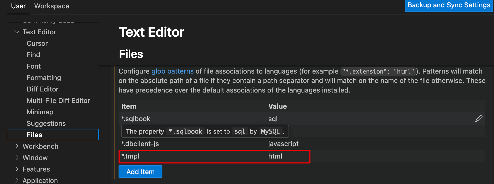
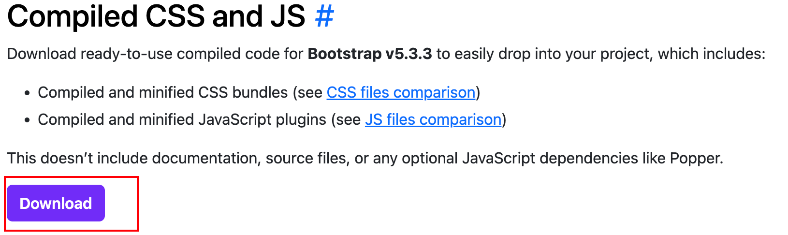
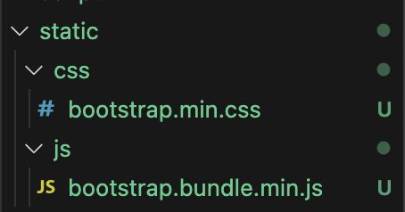

# Day2 : 搭建前端页面

由于本人前端知识有限，本次没有使用前后端分离。

而是基于HTTP框架[Hertz](https://www.cloudwego.io/zh/docs/hertz/)搭建前端页面。在这过程中使用的辅助工具有

- [go template(html/template)](https://pkg.go.dev/html/template)和[go template(text/template)](https://pkg.go.dev/text/template)搭建html框架。说实话官方文档还没[中文文档](https://www.topgoer.com/%E5%B8%B8%E7%94%A8%E6%A0%87%E5%87%86%E5%BA%93/template.html)简洁，建议先看中文文档。
- [boostrap](https://getbootstrap.com/docs/5.3/getting-started/introduction/)作为前端框架
- [fontawesome](https://fontawesome.com/)提供图标样式

具体前端搭建过程不详细介绍，见代码和以上工具官方文档。本节仅介绍搭建过程中涉及的关键概念。

## MVC模式

MVC是三个单词的首字母缩写，它们是Model（模型）、View（视图）和Controller（控制）。

这个模式认为，程序不论简单或复杂，从结构上看，都可以分成三层。

1. 最上面的一层，是直接面向最终用户的"视图层"（View）。它是提供给用户的操作界面，是程序的外壳。

2. 最底下的一层，是核心的"数据层"（Model），也就是程序需要操作的数据或信息。

3. 中间的一层，就是"控制层"（Controller），它负责根据用户从"视图层"输入的指令，选取"数据层"中的数据，然后对其进行相应的操作，产生最终结果。

[cwgo生成的代码结构](https://www.cloudwego.io/zh/docs/cwgo/tutorials/layout/#%E4%BB%A3%E7%A0%81%E7%BB%93%E6%9E%84)，也对应着MVC模式：

```
├── biz // 业务逻辑目录
│   ├── dal // Model层（数据访问层）
│   ├── handler // View 层
│   ├── service // Controller 层
```

## CDN

CDN（内容分发网络）指的是一组分布在各个地区的服务器。这些服务器存储着数据的副本，因此服务器可以根据哪些服务器与用户距离最近，来满足数据的请求。CDN 可以提供快速服务，较少受高流量影响。

CDN 被广泛用于传输样式表和 JavaScript 文件（例如 Bootstrap、jQuery 库等）的静态资源。

## 实战关键步骤

### 生成Hertz框架代码

为了生成Hertz框架，我们不得不填写一个idl文件，因此message设为空，Home服务也设为空

根据[官方HTTP服务端proto](https://www.cloudwego.io/zh/docs/cwgo/tutorials/server/example_pb/)修改

`api.proto`

```
// api.proto; 注解拓展
syntax = "proto2";

package api;

import "google/protobuf/descriptor.proto";

option go_package = "/api";

extend google.protobuf.FieldOptions {
    optional string raw_body = 50101;
    optional string query = 50102;
    optional string header = 50103;
    optional string cookie = 50104;
    optional string body = 50105;
    optional string path = 50106;
    optional string vd = 50107;
    optional string form = 50108;
    optional string js_conv = 50109;
    optional string file_name = 50110;
    optional string none = 50111;

    // 50131~50160 used to extend field option by hz
    optional string form_compatible = 50131;
    optional string js_conv_compatible = 50132;
    optional string file_name_compatible = 50133;
    optional string none_compatible = 50134;
    // 50135 is reserved to vt_compatible
    // optional FieldRules vt_compatible = 50135;

    optional string go_tag = 51001;
}

extend google.protobuf.MethodOptions {
    optional string get = 50201;
    optional string post = 50202;
    optional string put = 50203;
    optional string delete = 50204;
    optional string patch = 50205;
    optional string options = 50206;
    optional string head = 50207;
    optional string any = 50208;
    optional string gen_path = 50301; // The path specified by the user when the client code is generated, with a higher priority than api_version
    optional string api_version = 50302; // Specify the value of the :version variable in path when the client code is generated
    optional string tag = 50303; // rpc tag, can be multiple, separated by commas
    optional string name = 50304; // Name of rpc
    optional string api_level = 50305; // Interface Level
    optional string serializer = 50306; // Serialization method
    optional string param = 50307; // Whether client requests take public parameters
    optional string baseurl = 50308; // Baseurl used in ttnet routing
    optional string handler_path = 50309; // handler_path specifies the path to generate the method

    // 50331~50360 used to extend method option by hz
    optional string handler_path_compatible = 50331; // handler_path specifies the path to generate the method
}

extend google.protobuf.EnumValueOptions {
    optional int32 http_code = 50401;

// 50431~50460 used to extend enum option by hz
}

extend google.protobuf.ServiceOptions {
    optional string base_domain = 50402;

    // 50731~50760 used to extend service option by hz
    optional string base_domain_compatible = 50731;
}

extend google.protobuf.MessageOptions {
    // optional FieldRules msg_vt = 50111;

    optional string reserve = 50830;
    // 550831 is reserved to msg_vt_compatible
    // optional FieldRules msg_vt_compatible = 50831;
}
```

`home.proto`

```
// hello.proto
syntax = "proto3";

package frontend.home;

option go_package = "frontend/home";

import "api.proto";

message Empty {}

service HomeService {
   rpc Home(Empty) returns(Empty) {
      option (api.get) = "/";
   }
}
```

生成frontend目录，frontend页面代码放这里

```bash
mkdir -p app/frontend && cd app/frontend
```

生成Hertz框架

```bash
cwgo server --type HTTP  --idl ../../idl/frontend/home.proto  --server_name frontend  --module eCommerce/app/frontend -I ../../idl
```

### 配置Boostrap

在frontend中创建template目录存放.tmpl文件，.tmpl是模板文件，用于go-template

正常来说，.tmpl没有语法高亮和自动对齐等功能，我们要去IDE里面设置。

我使用的是vscode，以vscode为例：

打开settings->text editor->files补充下图中红框内容，默认.tmpl对应html文件

  

下一步，找到[boostrap官网 Quick Start](https://getbootstrap.com/docs/5.3/getting-started/introduction/)

复制以下内容到`home.tmpl`文件

```html
<!doctype html>
<html lang="en">
  <head>
    <meta charset="utf-8">
    <meta name="viewport" content="width=device-width, initial-scale=1">
    <title>Bootstrap demo</title>
    <link href="https://cdn.jsdelivr.net/npm/bootstrap@5.3.3/dist/css/bootstrap.min.css" rel="stylesheet" integrity="sha384-QWTKZyjpPEjISv5WaRU9OFeRpok6YctnYmDr5pNlyT2bRjXh0JMhjY6hW+ALEwIH" crossorigin="anonymous">
  </head>
  <body>
    <h1>Hello, world!</h1>
    <script src="https://cdn.jsdelivr.net/npm/bootstrap@5.3.3/dist/js/bootstrap.bundle.min.js" integrity="sha384-YvpcrYf0tY3lHB60NNkmXc5s9fDVZLESaAA55NDzOxhy9GkcIdslK1eN7N6jIeHz" crossorigin="anonymous"></script>
  </body>
</html>
```

为了使用这个模板，我们对代码做点修改

[Hertz-HTML渲染API](https://www.cloudwego.io/zh/docs/hertz/tutorials/basic-feature/render/#html)

View层：`handler/home/home_service.go`

```go
func Home(ctx context.Context, c *app.RequestContext) {
    ...
	// 返回html
	// resp为响应参数
	c.HTML(consts.StatusOK, "home.tmpl", resp)
	// utils.SendSuccessResponse(ctx, c, consts.StatusOK, resp)
}

```

`main.go`
```go
func main() {
...
    // 加载模板文件
	h.LoadHTMLGlob("template/*")

	h.Spin()
}
```

!!! tip "air插件"

    在之后的go-template编写中，我们每次都要使用`go run .`启动来查看更改代码后的效果，非常麻烦，这里推荐下载[air插件](https://github.com/air-verse/air)

启动frontend查看效果

```bash
air
```

看到这效果说明成功

  

这里的cdn可以改为本地

去官网[Download](https://getbootstrap.com/docs/5.3/getting-started/download/#compiled-css-and-js)

  

在frontend下面创目录static，并把下载好的文件丢进去

  

然后改`home.tmpl`把cdn改为本地`/static/css`和`/static/js`

```html
<!doctype html>
<html lang="en">
  <head>
    <meta charset="utf-8">
    <meta name="viewport" content="width=device-width, initial-scale=1">
    <title>Bootstrap demo</title>
    <link href="/static/css/bootstrap.min.css" rel="stylesheet" integrity="sha384-QWTKZyjpPEjISv5WaRU9OFeRpok6YctnYmDr5pNlyT2bRjXh0JMhjY6hW+ALEwIH" crossorigin="anonymous">
  </head>
  <body>
    <h1>Hello, world!</h1>
    <script src="/static/js/bootstrap.bundle.min.js" integrity="sha384-YvpcrYf0tY3lHB60NNkmXc5s9fDVZLESaAA55NDzOxhy9GkcIdslK1eN7N6jIeHz" crossorigin="anonymous"></script>
  </body>
</html>
```

接下来在`main.go`顺便添加注册静态资源的代码，以后可以从`/static/`中直接读取

>**注册静态资源**通常指的是将Web应用中的静态文件（如HTML文件、CSS样式表、JavaScript脚本、图片等）通过路由配置使得这些文件可以通过HTTP请求直接访问。这种做法常见于Web开发中，以便服务器能够快速响应客户端对于静态内容的请求，而不需要经过复杂的逻辑处理。

```go
func main() {
    ...
    h.Static("/static", "./")
    ...
```

### 前端编写

[UI设计工具](https://www.figma.com/figjam/)

接下来的过程就是去boostrap官网找对应组件的css，然后复制粘贴到`.tmpl`...

我感觉[boostrap入门教程](https://www.runoob.com/bootstrap/bootstrap-tutorial.html)还是菜鸟...

前端编写的时候[F12 开发者工具](https://cloud.tencent.com/developer/article/1872933)很关键，必学

这里面会涉及boostrap的containers和grid system，简单介绍以下：

#### container

container 类用于包裹内容并提供一个响应式的固定宽度容器。它确保你的内容在不同尺寸的屏幕上都有良好的布局和对齐效果。Bootstrap提供了两种主要的容器类：

`.container`：为你的项目提供一个响应式的固定宽度容器。它根据屏幕尺寸调整其宽度，在超小屏幕（<576px）上是100%宽度，并且在更大的屏幕上（如小屏幕≥576px、中等屏幕≥768px、大屏幕≥992px、超大屏幕≥1200px以及在Bootstrap 5中的超大屏幕≥1400px）有特定的最大宽度。
.container-fluid：提供了一个全宽的容器，占据视口（viewport）的全部宽度，无论屏幕大小如何。

#### Grid System

Grid System 是一个用于创建响应式布局的强大工具。它基于灵活的栅格布局，允许你快速设计适应不同设备和屏幕尺寸的网页布局。Bootstrap 5 中的网格系统主要依赖于容器（.container 或 .container-fluid）、行（.row）和列（.col-*）的组合来构建布局。

**基本结构**

一个基本的 Bootstrap 网格结构包括：

- 容器（.container 或 .container-fluid）：定义整个内容区域的宽度。.container 提供响应式的固定宽度，而 .container-fluid 则是全宽，跨越整个宽度。
- 行（.row）：用来放置列，需要放在容器内。行使用负边距（margin）抵消列之间的间距，确保内容对齐。
- 列（.col-*）：放置在行内部，用来容纳你的内容。你可以使用不同的类来指定列的宽度和行为。

**列的定义**

预定义网格类：如 `.col-*`，其中 * 可以是从 1 到 12 的数字，表示该列占据的栅格数。例如，`.col-6` 表示占据半个宽度（即12列中的6列）。
针对不同屏幕尺寸的类：如 `.col-sm-*`, `.col-md-*`, `.col-lg-*`, `.col-xl-*`, `.col-xxl-*` 分别适用于小、中、大、超大和特大屏幕。这些类允许你为不同的屏幕尺寸设置不同的列宽。

### FAQ 

#### `api.proto`是什么

api.proto提供了注解，[api.proto官方文档](https://www.cloudwego.io/zh/docs/hertz/tutorials/toolkit/annotation/)

#### `go_package`怎么写

推荐用户定义如`“{$MODULE}/{$MODEL_DIR}/x/y/z”` (其中 {$MODEL_DIR} 默认为"biz/model", 用户也可使用“model_dir”选项来定义) 这样的“go_package”。